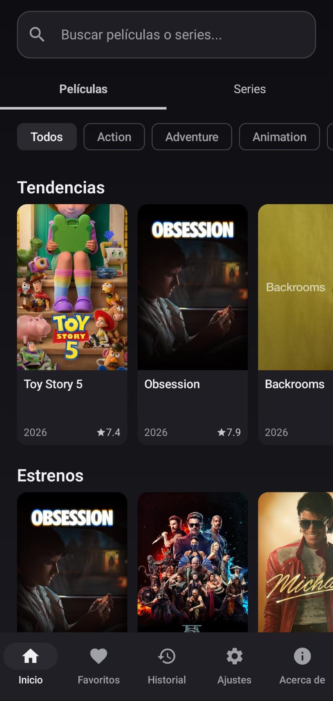
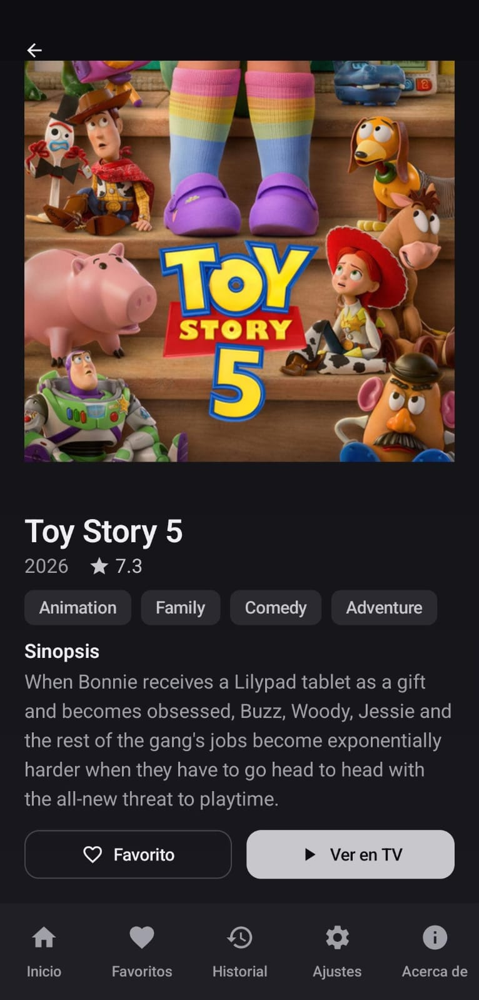
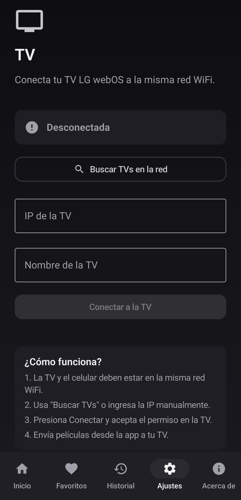

<p align="center">
  
</p>

<h1 align="center">Kast — App Android para TVs LG webOS</h1>

<p align="center">
  Aplicación Android para descubrir películas y series, y enviarlas directamente a tu TV LG webOS.
</p>

<p align="center">
  
  
  
  
</p>

<p align="center">
  <a href="../../releases/latest">
    
  </a>
</p>

---

Kast es una aplicación Android de código abierto que permite descubrir películas y series mediante [TMDB](https://www.themoviedb.org/) y enviarlas directamente a televisores LG webOS usando el protocolo nativo SSAP. No requiere cuenta, no requiere backend, y no aloja contenido multimedia.

---

## ¿Qué es Kast?

Kast es una app Android pensada para usuarios que tienen una TV LG webOS en casa y quieren buscar películas o series desde su celular y enviarlas a la TV de forma rápida. Usa TMDB para obtener la información de películas y series, y se comunica con la TV mediante el protocolo SSAP sobre WebSocket (WSS).

No necesitás cuenta, login ni servidor multimedia. Todo funciona de forma local: la app busca en TMDB, guarda favoritos e historial en tu celular, y envía la URL de reproducción a tu TV LG webOS.

Kast no aloja, transmite ni distribuye ningún contenido multimedia. Los metadatos provienen de TMDB y la reproducción se realiza a través de [UnlimPlay](https://unlimplay.com/).

## ¿Por qué existe Kast?

Las soluciones existentes para controlar TVs LG webOS suelen depender de DLNA, Chromecast, servidores multimedia (como Plex o Kodi) o aplicaciones propietarias como LG ThinQ. Muchas de estas alternativas requieren configuración compleja, cuentas, o no están diseñadas específicamente para el flujo de buscar → ver → enviar a TV.

Kast está pensado para usuarios Android que quieren un camino directo: buscan una película o serie, la revisan, y la envían a su TV LG webOS con un toque. No requiere cuenta, no requiere backend, no requiere servidor multimedia. Usa TMDB para los metadatos y SSAP para comunicarse con la TV, manteniendo la experiencia simple y local.

## Casos de uso

- Enviar películas a una TV LG desde Android
- Ver series en una TV LG webOS
- Controlar una TV LG desde el celular
- Buscar películas y series con TMDB
- Usar una alternativa ligera a Web Video Caster para LG
- Usar una alternativa técnica a LG ThinQ para reproducción
- Probar una app open source para LG webOS

---

## Capturas

<p align="center">
  
  
  
</p>

## Características

- **Películas y series** — Tendencias, estrenos, mejor valoradas, series populares
- **Búsqueda unificada** — Busca películas y series en una sola barra
- **Detalle completo** — Póster, sinopsis, calificación, año, géneros
- **Series** — Temporadas y episodios con selección
- **Favoritos** — Guarda películas favoritas localmente (Room)
- **Historial** — Registra lo que viste y lo que enviaste a la TV
- **Discovery de TVs** — Encuentra TVs LG automáticamente en la red (SSDP)
- **Envío a TV** — Envía películas a una TV LG webOS mediante WSS + SSAP
- **Skeleton loaders** — Carga visual suave
- **Tema oscuro** — Diseño minimalista en negro, gris y blanco
- **Configuración en-app** — Token TMDB configurable sin recompilar

## Descarga

Descarga la última APK desde GitHub Releases:

[**Descargar APK**](../../releases/latest)

## Tech Stack

| Capa | Tecnología |
|------|-----------|
| Lenguaje | Kotlin |
| UI | Jetpack Compose + Material 3 |
| Networking | Retrofit + OkHttp |
| Imágenes | Coil |
| Persistencia | Room + DataStore |
| TMDB | API v4 (Read Access Token) |
| TV | WebSocket + protocolo SSAP |
| Discovery | UDP multicast (SSDP) |

## Instalación

### Requisitos

- Android SDK Platform 35
- JDK 17+ (el wrapper lo detecta automáticamente)

### Build

```bash
.\gradlew.bat :app:assembleDebug --console=plain
```

### Instalar en dispositivo

```bash
adb install app/build/outputs/apk/debug/app-debug.apk
```

## Configurar TMDB

1. Creá una cuenta en [themoviedb.org](https://www.themoviedb.org/)
2. Generá un **API Read Access Token** (v4) en Settings > API
3. Abrí la app → pestaña **Ajustes** → pegá el token

La app compila sin token y muestra un botón para configurarlo.

## Configurar TV LG

1. La TV y el celular deben estar en la **misma red WiFi**
2. Ir a la pestaña **TV** en la app
3. Presioná **Buscar TVs** o ingresá la IP manualmente
4. Seleccioná la TV y presioná **Conectar**
5. Aceptá el permiso en la pantalla de la TV
6. Desde cualquier película, presioná **Ver en TV**

La configuración (IP y client key) se guardan localmente.

---

## Kast vs alternativas

| | Kast | Web Video Caster | LG ThinQ |
|---|------|-----------------|----------|
| Open source | ✅ MIT | ❌ | ❌ |
| Sin cuenta | ✅ | ✅ | ❌ |
| Enfocado en LG webOS | ✅ | ❌ Multiplataforma | ✅ |
| TMDB integrado | ✅ | ❌ | ❌ |
| Favoritos e historial | ✅ | ❌ | ❌ |
| Temporadas y episodios | ✅ | ❌ | ❌ |
| Usa SSAP nativo | ✅ | ❌ DLNA | ✅ |

Para una comparación más amplia con Kodi, Plex, Jellyfin y otras herramientas, revisa [COMPARISON.md](COMPARISON.md).

---

## Preguntas frecuentes

**¿Kast funciona con cualquier TV?**
No. Kast solo funciona con TVs LG que ejecuten webOS y soporten el protocolo SSAP. La mayoría de las TVs LG de 2014 en adelante son compatibles.

**¿Necesito una cuenta?**
No. Kast funciona sin cuenta, login ni registro. Solo necesitás un token de TMDB (gratuito).

**¿Kast almacena películas o series?**
No. Kast es solo un navegador de metadatos (TMDB) y un controlador remoto. No almacena, transmite ni distribuye contenido multimedia.

**¿Necesito un token de TMDB?**
Sí. TMDB es la fuente de datos. Necesitás un API Read Access Token v4, que es gratuito y se configura desde la app.

**¿Kast funciona con Chromecast o Samsung TV?**
No. Kast usa el protocolo SSAP nativo de LG webOS. No compatible con Chromecast, Samsung, Sony, ni otros fabricantes.

Para más preguntas, revisa [FAQ.md](FAQ.md).

---

## Desarrollo

### Ejecutar tests

```bash
.\gradlew.bat clean :app:testDebugUnitTest :app:lintDebug :app:assembleDebug --console=plain
```

- Unit tests con fakes y Robolectric
- No requieren token de TMDB ni dispositivo conectado
- Room tests con base de datos en memoria

### Arquitectura

```
app/src/main/java/com/kastlg/app/
├── data/           # Room, Retrofit, DTOs, SSAP client, discovery
├── di/             # AppContainer (dependency injection)
├── domain/         # Models, repositories, use cases
└── presentation/   # Compose screens, ViewModels, theme
```

## Créditos

- **Películas y series**: [TMDB](https://www.themoviedb.org/)
- **Reproducción**: [UnlimPlay](https://unlimplay.com/)
- **TV compatible**: LG webOS (WSS + SSAP)

> Kast utiliza TMDB para mostrar información de películas y series. La reproducción se realiza mediante UnlimPlay. Kast no aloja contenido multimedia ni distribuye archivos de video.

## Licencia

[MIT License](LICENSE)
